# TP1 file tree
On active le virtual environment et on genère les données depuis generate_data.py:

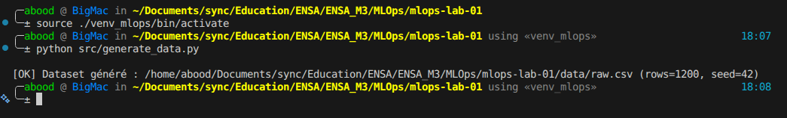

Puis on prépare les données

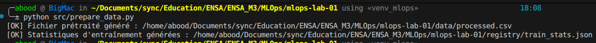

Puis en entraine le modèle

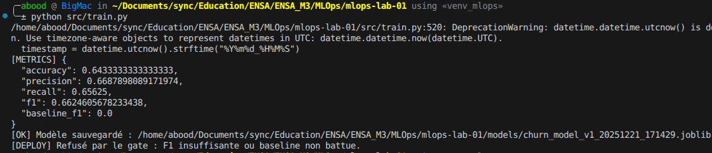

Ensuite l'evaluation

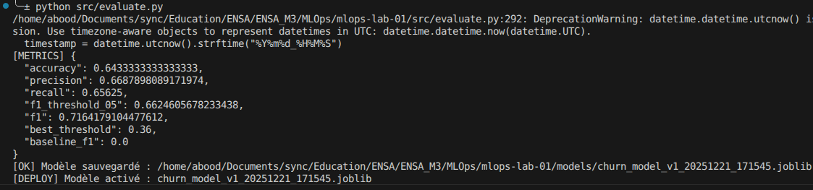

On start fastapi

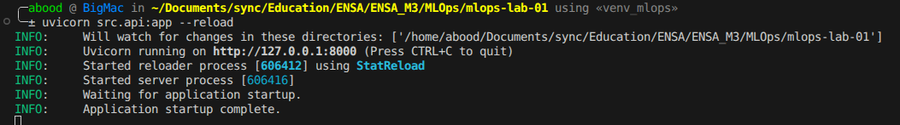

tester get method

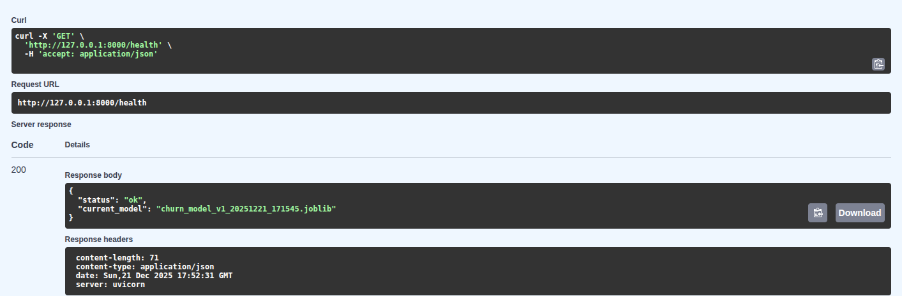

post method 

tester drift

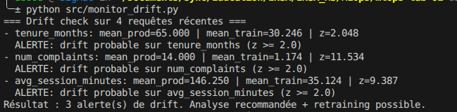

On entraine un nouveau modèle, puis on test roll back

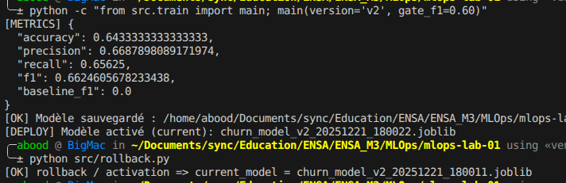

files tree final

---
# TP2 all commits

on initialize le repo

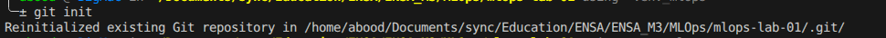

gitigore

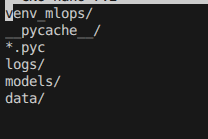

git status

on ajoute les files au stage

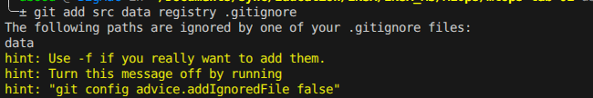

commit

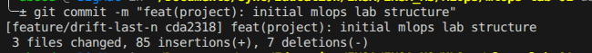

afficher l'historique

on voie la difference aprés modifier monitor_drift.py

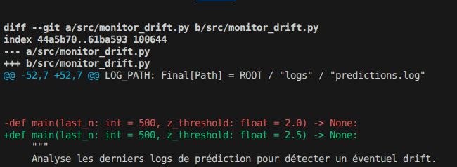

On l'ajoute et voire la difference en stage

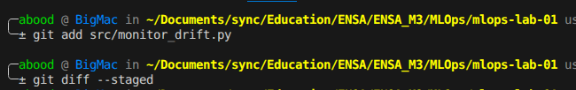
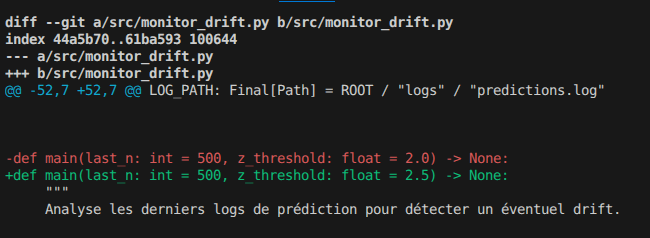

puis commit

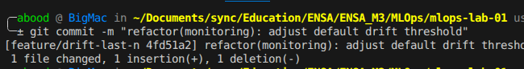

créer une branche

On modifie api.py, l'ajoute au stage, puis commit

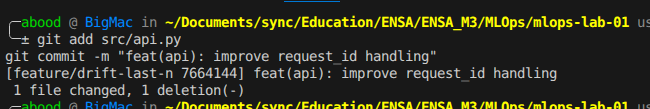

lister les branches avec `git branch`

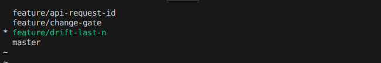

On select master branche

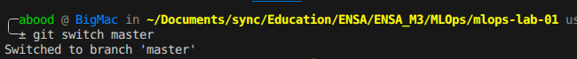

on merge master avec feature/api-request-id branch

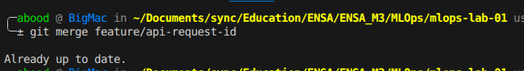

afficher l'historique

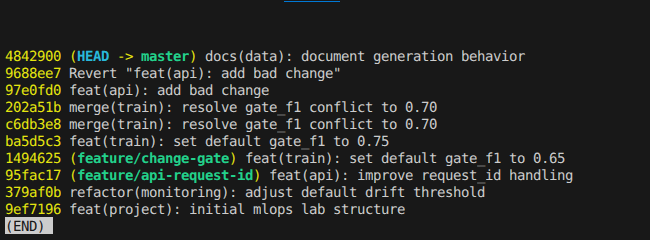

---

On crée une nouvelle branch

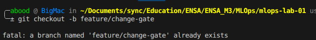

On modifie train.py puis add and commit

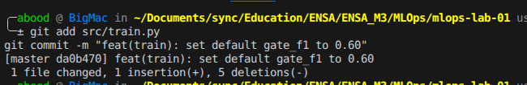

On switch to master

On modifie encore une fois train.py et on essaie de fusioner 

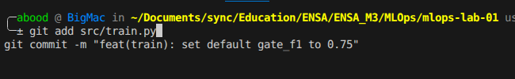

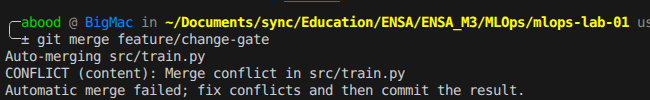

On résoudre le conflit

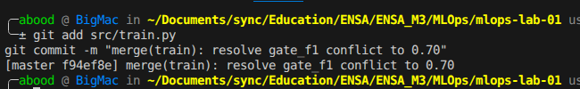

---

On modifie rollback.py et on met de côté les modifications

Stach list avec git stash list

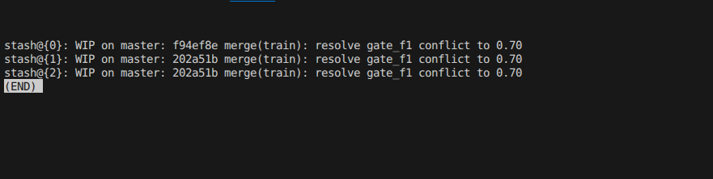

Récupérer les modifications

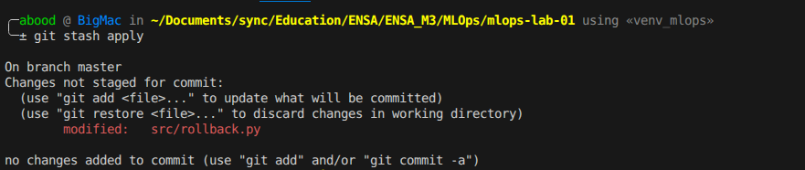

---

On crée un fichier de test

On le modifie et comitter 2 fois

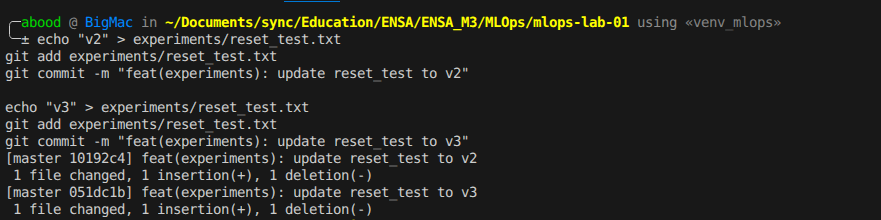

Effectuer un reset soft 

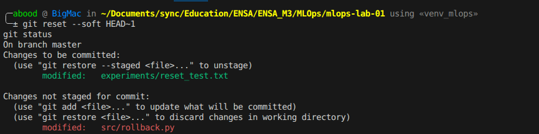

Effectuer un reset mixed

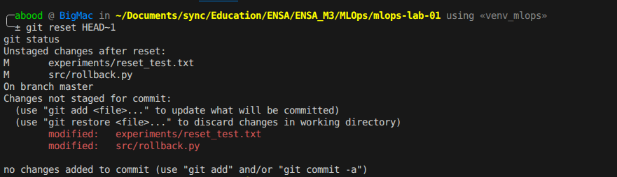

Effectuer un reset hard

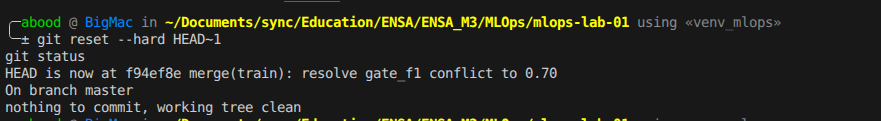

---

Ajouter un changement non souhaité dans src/api.py

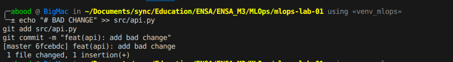

Lister les commits

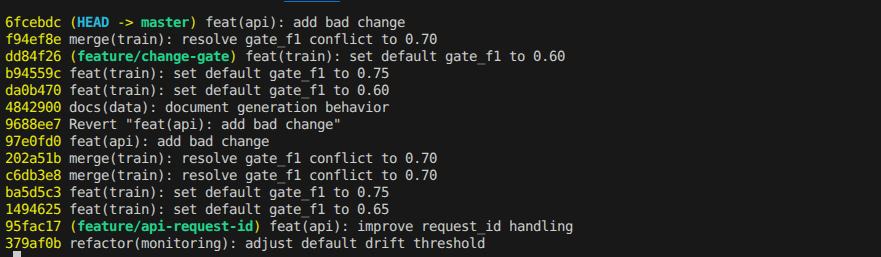

Revert du dernier commit

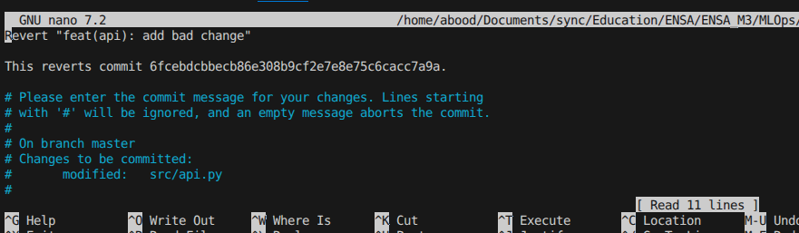

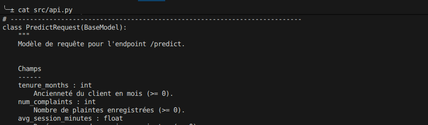

---

Créer branche feature/drift-last-n

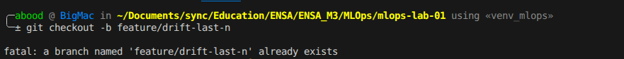

On modifie monitor_drift.py ...

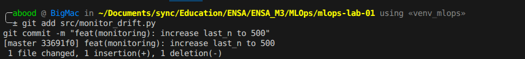

Revenir sur la branche principale et créer un nouveau commit

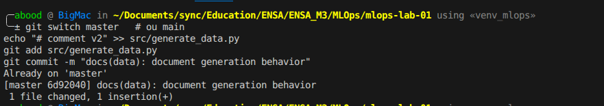

Revenir sur la branche feature

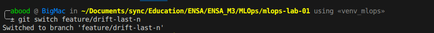

Rebaser la branche feature sur la branche principale

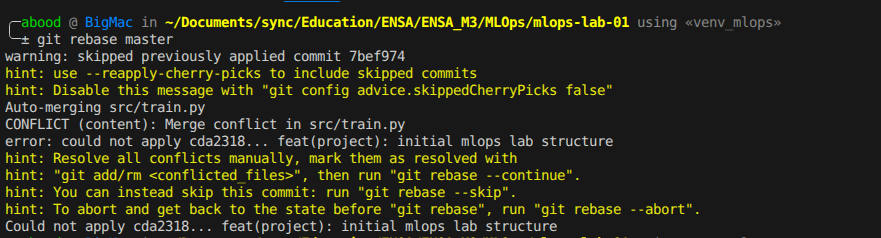

Vérifier l’historique

